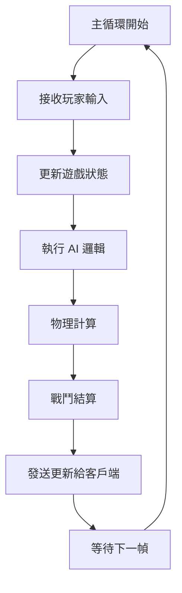

# Source Code 架構說明

本目錄是 Open MOBA Backend 的核心源代碼目錄，包含了整個遊戲服務器的實現。

## 🏗️ 整體架構

專案採用 ECS (Entity Component System) 架構，將遊戲邏輯分解為：
- **Entity（實體）**: 遊戲中的物件（英雄、小兵、塔等）
- **Component（組件）**: 實體的屬性（位置、血量、攻擊力等）
- **System（系統）**: 處理組件的邏輯（移動、戰鬥、技能等）

## 📁 目錄結構

```
src/
├── comp/               # ECS 組件定義
│   ├── phys.rs        # 物理組件（位置、速度）
│   ├── attack.rs      # 攻擊組件
│   ├── hero.rs        # 英雄組件
│   ├── skill.rs       # 技能組件
│   └── ...
├── tick/               # 遊戲更新系統
│   ├── hero_tick.rs   # 英雄行為系統
│   ├── skill_tick.rs  # 技能系統（整合 ability-system）
│   ├── damage_tick.rs # 傷害計算系統
│   └── ...
├── config/             # 配置管理
│   └── server_config.rs # 服務器配置
├── ue4/                # UE4 地圖導入
│   └── reader.rs      # 地圖數據讀取
├── msg.rs              # 網路消息定義
├── json_preprocessor.rs # JSON 註解處理器
├── main.rs             # 程序入口
└── lib.rs              # 庫定義（如果有）
```

## 🔑 核心模組說明

### main.rs - 程序入口

負責：
1. 初始化日誌系統（log4rs）
2. 載入服務器配置（game.toml）
3. 建立 ECS World
4. 註冊所有組件和系統
5. 啟動 MQTT 連接
6. 運行遊戲主循環（10 TPS）

### msg.rs - 消息系統

定義了客戶端與服務器之間的通信協議：
- `PlayerData`: 玩家數據結構
- `MqttMsg`: MQTT 消息格式
- 消息序列化/反序列化處理

### json_preprocessor.rs - JSON 處理器

提供支援 C 風格註解的 JSON 解析功能：
- 支援 `//` 單行註解
- 支援 `/* */` 多行註解
- 用於技能配置檔案的解析

## 🎮 遊戲循環流程



### 系統執行順序

1. **輸入階段**: 處理 MQTT 消息，更新玩家指令
2. **邏輯階段**: 執行遊戲邏輯（技能、AI、移動等）
3. **物理階段**: 更新位置、處理碰撞
4. **結算階段**: 計算傷害、處理死亡
5. **輸出階段**: 發送狀態更新給客戶端

## 🚀 關鍵特性

### 高性能設計

1. **ECS 架構**: 優化的數據局部性和快取友好
2. **並行處理**: 使用 Rayon 進行多線程運算
3. **批次操作**: 減少系統調用和內存分配
4. **空間索引**: 快速的範圍查詢（nearby_tick）

### 技能系統整合

- 主系統在 `tick/skill_tick.rs`
- 子系統在 `ability-system/` crate
- 支援 JSON 配置和硬編碼技能混合使用
- 熱更新技能配置（無需重啟）

### 網路架構

- 基於 MQTT 的發布/訂閱模式
- 低延遲的消息傳遞
- 支援大規模玩家連接
- 消息批次處理優化

## 🔧 開發指南

### 添加新功能

1. **新組件**: 在 `comp/` 創建組件定義
2. **新系統**: 在 `tick/` 實現系統邏輯
3. **註冊**: 在 `main.rs` 中註冊組件和系統
4. **測試**: 編寫單元測試和集成測試

### 編碼規範

- 遵循 Rust 官方風格指南
- 使用 `cargo fmt` 格式化代碼
- 使用 `cargo clippy` 檢查代碼質量
- 添加適當的文檔註釋

### 性能優化建議

1. 優先使用 `VecStorage` 對於常見組件
2. 使用 `par_join()` 進行並行迭代
3. 避免在熱路徑上分配內存
4. 利用 ECS 的批次處理特性

## 📊 監控與調試

### 日誌系統

使用 log4rs 進行分級日誌：
- `ERROR`: 嚴重錯誤
- `WARN`: 警告信息
- `INFO`: 一般信息
- `DEBUG`: 調試信息
- `TRACE`: 詳細追蹤

### 性能分析

1. 使用 `prof_span!` 宏進行性能標記
2. 監控各系統的執行時間
3. 追蹤內存使用情況
4. 分析網路流量

## 🔗 相關資源

- [ECS 架構詳解](comp/README.md)
- [系統設計文檔](tick/README.md)
- [配置管理說明](config/README.md)
- [地圖導入指南](ue4/README.md)